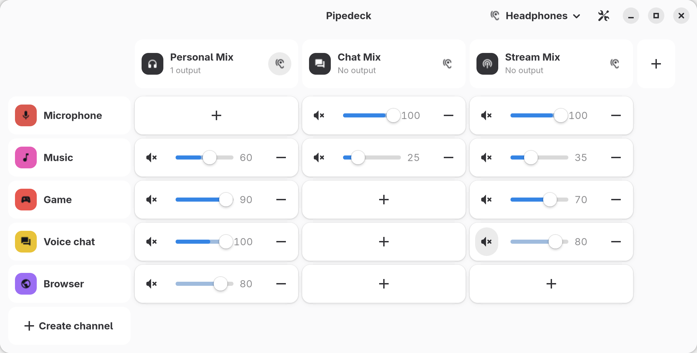
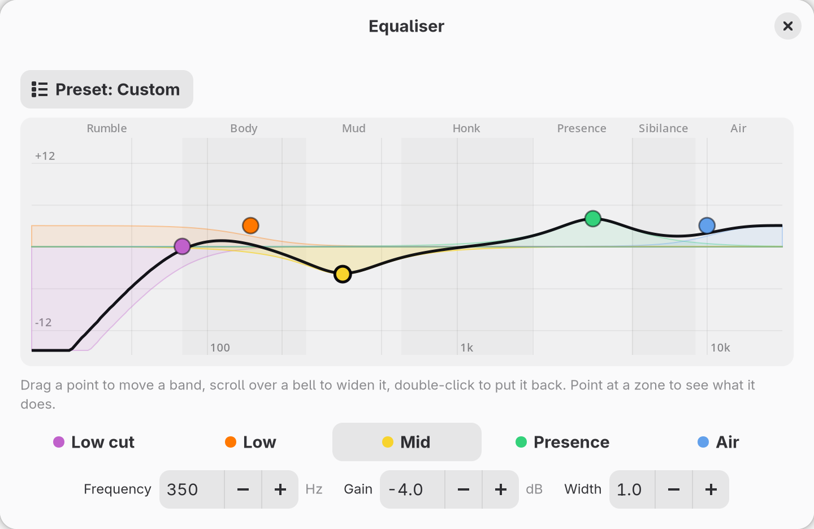

<h1 align="center">
  <picture>
    <source media="(prefers-color-scheme: dark)" srcset=".github/banner-dark.svg">
    
  </picture>
</h1>

A PipeWire mixer for Linux streamers, in the spirit of Elgato Wave Link.
Send each application to a channel, then decide how loud every channel is
in each mix: what you hear, what goes to the stream and what goes to the
call are separate balances.

- **A matrix mixer**: channels are rows, mixes are columns, and each cell has
  its own fader and mute.
- **Effects per channel**: noise suppression, equaliser, de-esser and
  compressor built in, plus VST3 plug-ins and Thimeo's Stereo Tool.
- **Meters** on every channel, mix and cell.
- **Stream Deck** support through OpenDeck or StreamController, with keys
  and dials that look like the mixer.
- **Discord calls** split into one track per person, with Vesktop.
- Lives through PipeWire and WirePlumber restarts.

<p align="center">
  <picture>
    <source media="(prefers-color-scheme: dark)" srcset=".github/mixer-dark.png">
    
  </picture>
</p>

## Installing

Each [release](https://github.com/2c2t-dev/PipeDeck/releases) has:

| Package | For |
| --- | --- |
| `.deb` | Debian 13, Ubuntu 25.04 and later |
| `.rpm` | Fedora 42 and later |
| `.AppImage` | Other distributions with glibc 2.41 or later. It carries GTK and libadwaita, and uses the system's PipeWire. |

All three need a GTK at least 4.18, a libadwaita at least 1.7 and PipeWire
1.2 or later, which is why older releases are not covered.

## Building

Requirements: PipeWire ≥ 1.2 (with headers), GTK ≥ 4.18, libadwaita ≥ 1.7,
clang (for bindgen), pkg-config and Rust ≥ 1.92.

```sh
cargo build --release
./target/release/pipedeck
```

Run this way, or from an AppImage, Pipedeck adds itself to the launcher,
with its icon, under `~/.local/share` on its first start.

## How it works

**Channels** (rows) are where sound comes from. A channel is either a
virtual output, which any application can pick in its audio settings, or a
capture device such as a microphone. You can attach applications to a
channel: Pipedeck moves their audio there whenever they start playing.

**Mixes** (columns) are where sound goes. Each mix is an input device named
after it: OBS, Discord or a browser list it with the microphones. A mix can
also play to one or more output devices, each with its own level. There can
be up to five mixes: Personal, Chat, Stream, Record and Aux.

**Cells** connect a channel to a mix. A cell exists only once you press `+`
on it, and it carries that pair's fader and mute.

**The ear** on a mix card says whether you hear that mix in your
headphones. The button in the header bar chooses which device your
headphones are, and moves every mix you listen to when you change it.

A channel's or a mix's level is the volume of its PipeWire node, so a volume
applet or a media key moves the fader too. Cards can be reordered by
dragging them by their grip, and a click on a card opens its settings.

## Effects

Effects run on a channel, and every mix hears the result. A channel bound to
a microphone runs them too. Mixes have no effects.

| Effect | What it does |
| --- | --- |
| Noise suppression | Removes fans, keyboards and hiss behind a voice (RNNoise, 10 ms of delay). |
| Equaliser | Five bands shaped for a voice, set by dragging them on a curve, with presets. |
| De-esser | Turns down harsh s and sh sounds. *Learn from my voice* sets it for you. |
| Compressor | Evens out loud and quiet moments. *Learn from my voice* sets it for you. |

<p align="center">
  <picture>
    <source media="(prefers-color-scheme: dark)" srcset=".github/equaliser-dark.png">
    
  </picture>
</p>

Each effect can be switched off without removing it. Changing a setting is
heard at once; adding or removing an effect stops the audio for a moment.

**VST3 plug-ins** are read from the usual folders and from `VST3_PATH`. The
**Plug-ins** page of the settings installs a `.vst3` bundle, or a bare `.so`,
into `~/.vst3`. Plug-in windows are not supported yet, so their parameters
stay at their defaults.

**Stereo Tool** is proprietary and not bundled: download it from
[thimeo.com](https://www.thimeo.com/stereo-tool/download/) and import the
archive from the **Plug-ins** page. Only the builds for your machine are
kept, in `~/.local/share/pipedeck/stereotool/`. Its own window opens from the
effect (X11 builds only), or load a preset exported from it. Without a
licence key it inserts speech and beeps into the audio. It adds 50 to 100 ms
of delay.

## Stream Deck and Discord

| Integration | What it does |
| --- | --- |
| [OpenDeck plugin](integrations/opendeck/README.md) | Mutes, levels, the mix you hear, effects and more on keys and dials, with meters. Ready-made profiles for the Stream Deck, Stream Deck + and XL. |
| [StreamController plugin](integrations/streamcontroller/README.md) | The same actions and the same look, for StreamController. |
| [Vesktop plugin](integrations/vencord/README.md) | Splits the Discord call into one sub-track per person, each with its own level and mute, remembered for the next call. |

All three are installed from **Settings → Plug-ins**. They talk to the
mixer through its control socket, `$XDG_RUNTIME_DIR/pipedeck/control.sock`.

On KDE, **Application in front** lets a Stream Deck key send the application
you are looking at to a channel.

## Settings

- **General**: colour theme, start at login, keep running in the
  notification area when the window is closed (`pipedeck --background`
  starts it that way, Ctrl+Q quits), and drawing without the graphics card
  if text shows up damaged.
- **Audio**: the quantum Pipedeck's nodes ask for, 512 frames by default.
  Raise it if you get xruns.
- **Plug-ins**: VST3, Stereo Tool, Stream Deck and Discord.

The mixer is saved in `$XDG_CONFIG_HOME/pipedeck/config.toml`, the window's
own settings in `interface.toml` next to it.

## Environment variables

| Variable | Use |
| --- | --- |
| `RUST_LOG` | Log level, e.g. `RUST_LOG=pipedeck_engine=debug`. |
| `PIPEDECK_APP_ID` | Run a development build next to an installed one. |
| `PIPEDECK_CONTROL_SOCKET` | Use another path for the control socket. |
| `PIPEDECK_NODE_PREFIX` | Name the nodes differently, so two mixers can run side by side. |
| `PIPEDECK_STEREOTOOL` | Load Stereo Tool from somewhere else. |
| `PIPEDECK_STEREOTOOL_NOISE` | Show what Stereo Tool writes to the terminal, which is hidden otherwise. |
| `VST3_PATH` | More folders to look for VST3 plug-ins in. |

## Development

| Folder | Contents |
| --- | --- |
| `crates/pipedeck-engine` | The PipeWire graph, the config and the control socket. No GTK. |
| `crates/pipedeck` | The GTK 4 and libadwaita application. |
| `integrations/opendeck` | The OpenDeck plugin, in Rust. |
| `integrations/streamcontroller` | The StreamController plugin, in Python. |
| `integrations/vencord` | The Vesktop plugin. |

Checks against the live PipeWire server, all run with
`cargo run -p pipedeck-engine --example <name>`:

| Example | Checks |
| --- | --- |
| `smoke` | Builds a whole mixer, plays a tone through it and checks every node, then that nothing is left behind. It runs next to your own Pipedeck without touching it. |
| `relink_check` | The mixer repairs itself after WirePlumber restarts. |
| `reconnect_check` | The mixer comes back after PipeWire restarts. Point `PIPEWIRE_REMOTE` at a private server, since restarting your own cuts all audio. |
| `plugins`, `plugin_check [name]` | Lists the VST3 plug-ins, runs a tone through one. |
| `stereotool_check [preset.sts]` | Runs a tone through Stereo Tool; `--window` also shows its window. |

`packaging/package.sh deb|rpm|appimage` builds a package into `dist`, on
the system it is for; the release workflow runs it on every tag.

`cargo run -p pipedeck --example screenshot .github [--light]` draws the
README's pictures from a made-up mixer, without touching yours. Run it on
GTK's Broadway backend (`gtk4-broadwayd :5 &`, then
`GDK_BACKEND=broadway BROADWAY_DISPLAY=:5`) so nothing shows on screen.

### PipeWire nodes

What Pipedeck puts on the graph, as `pw-dump`, `pw-top` or qpwgraph show it.
`N` is a channel's id, `M` a mix's.

| Node | What it is |
| --- | --- |
| `pipedeck.src.N` | A channel: the sink applications play into. |
| `pipedeck.voice.N.<user>` | One person of a Discord call, playing into their channel. |
| `pipedeck.fx.N`, `pipedeck.vst.N` | The channel once its effects have run, which the cells then read. |
| `pipedeck.link.N.M` | A cell: a loopback carrying the cell's fader and mute. |
| `pipedeck.mix.M` | A mix: the source OBS records. |
| `pipedeck.out.M.<index>` | A mix playing to an output device. |
| `pipedeck.meter.*` | What the meters listen to. |

A channel is a sink, and a mix is a source, which is why each shows up in
only one list. A session manager routes nothing into a source, so Pipedeck
links the cells into their mix itself, port by port.

Every node belongs to Pipedeck's own PipeWire connection, so if Pipedeck
dies, nothing is left behind. On quitting, it hands the applications it
moved back to the session manager.

## License

Pipedeck is under the [MIT License](LICENSE).

The interface icons are [Material Symbols](https://fonts.google.com/icons),
under the Apache License 2.0, in `crates/pipedeck/icons`.
